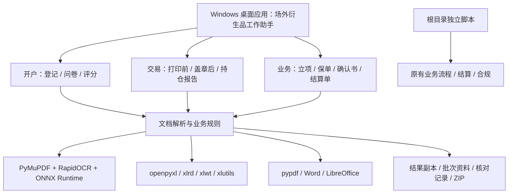

# HSQH 金融业务运营自动化工具集

> 当前项目版本：**V3.0** · 更新日期：**2026-09-18**
>
> **Windows 桌面应用：[前往 GitHub Releases 下载最新版](https://github.com/Anbo-WU/HSQH/releases)**

HSQH 从金融业务部门的日常工作中沉淀而来，覆盖业务、交易、开户、结算和合规等运营场景，自动完成 Word、PDF、Excel 材料的识别、提取、计算、校验、整理和交付。

**V3.0 将项目从需要终端指令运行的脚本工具集，推进为可直接复制使用的 Windows 桌面应用。** 新增的「场外衍生品工作助手」将开户、交易和业务流程整合到统一图形界面，用户通过选择岗位、拖入材料、选择保存位置和点击运行即可完成处理，无需安装 Python、配置开发环境或输入命令。根目录原有工具继续保留，本次功能扩展主要集中在 `exe/` 下的 Windows 适配与桌面发行包。

## 下载与版本说明

**最新版 Windows 桌面应用已上传至 [GitHub Releases](https://github.com/Anbo-WU/HSQH/releases)。** 请在发布页面的 **Assets（资源）** 中下载桌面应用 ZIP，并按该版本附带的使用说明运行。

- **源码仓库**：提供已提交的业务脚本、模板和相关说明，适合阅读代码、了解规则及二次开发。
- **桌面发行包**：提供可直接运行的 Windows 应用、运行组件、OCR 模型和空白模板，适合日常业务使用和分发给同事。
- **同步状态**：本地桌面应用为最新开发成果，尚未完整同步到 GitHub 源码仓库；获取最新可用桌面版请以 Releases 附件为准。`git clone`、仓库的 Download ZIP，以及 Release 自动生成的 `Source code` 压缩包不等同于桌面发行包。

项目版本与桌面应用版本分别管理：本 README 对应 **HSQH V3.0**，本地桌面发行包的 `版本信息.json` 标记为 **1.1.0**。后续应用更新以 Releases 页面和包内版本信息为准。

## V3.0 主要更新

- **统一桌面入口**：以「开户 / 交易 / 业务」组织功能，提供文件拖入、文件夹选择、参数设置、处理状态、停止任务和打开结果等操作。
- **便于复制和迁移**：Windows x64 发行包包含 Python 运行组件、本地 OCR 模型、空白模板和持仓报告所需的 LibreOffice 组件；完整解压后即可启动。
- **开户功能扩展**：客户资料批量登记、财报字段提取、多名授权人与受益人信息配对、逐字段来源追溯、异常留空标黄；问卷支持答案提取、风险评分及连续处理，Windows 下支持文字和扫描 PDF。
- **交易功能扩展**：保留 LuX、Tan、Zhang、LuT 确认书工作流，新增 PAN 结算单 / 确认书与持仓报告处理，覆盖打印前登记合并、盖章后拆分校验和 ZIP 交付。
- **业务功能扩展**：整合保期立项表、保单识别、确认书识别与结算单识别，支持按确认书编号匹配、金额及资金构成校验和核对记录输出。
- **交付与复核完善**：桌面应用按任务创建独立结果目录，使用输入表格或模板的副本，保留批次资料、来源记录和异常提示，便于复核、移交及继续处理。

## 功能概览

| 岗位 | 主要功能 | 当前入口 |
| --- | --- | --- |
| 开户 | 客户资料识别与登记、20 题问卷答案提取、总分及 C1～C5 风险等级计算 | Windows 桌面应用；`exe/开户/` 与根目录 `开户/` 脚本 |
| 交易 | 确认书预检查、登记表、Word 转 PDF、合并、盖章扫描件拆分与命名；PAN 结算单及持仓报告 | Windows 桌面应用、`exe/交易/main.py`；根目录保留原四人员流程 |
| 业务 | 保期立项汇总、保单字段匹配、确认书与结算单数据提取 | Windows 桌面应用、`exe/业务/`；根目录保留立项与数据统计脚本 |
| 结算 | 累计远期到期匹配、导出表拆分、格式改版、收益校验、归档交付 | 根目录 `结算/` 独立脚本 |
| 合规 | 按客户名称匹配参考表，补充客户性质并保留已有值 | 根目录 `合规/` 独立脚本 |

当前桌面应用整合前三个岗位；业务菜单中的「结算单识别」与根目录结算岗位的「远期了结记录改版」是不同流程。

## Windows 桌面版快速开始

适用系统：**Windows 10 / 11，Intel / AMD 64 位电脑**。

1. 从 [GitHub Releases](https://github.com/Anbo-WU/HSQH/releases) 下载桌面应用 ZIP，完整解压到本地可访问的文件夹。
2. 双击 `场外衍生品工作助手.exe`。请保留旁边的 `_internal` 文件夹，复制或迁移时一起保留整个软件目录。
3. 在左侧选择岗位与功能，添加文件或材料文件夹；交易任务需同时选择人员和材料类型。
4. 选择结果保存目录，确认日期、批次或其他选项，点击开始处理。
5. 完成后打开结果表或结果目录，结合核对记录复核；交易打印前的整个结果文件夹需保留至盖章后处理。

日常处理不需要终端或开发工具。查看生成的 Excel 文件可使用已有的 Excel / WPS；**交易输入含 Word 文件且需要转 PDF 时，仍需本机安装桌面版 Microsoft Word**。PDF 输入可直接处理，持仓表格转换使用包内 LibreOffice。

桌面应用一次处理一项任务。每次运行建立独立结果目录，不覆盖所选原始材料和已有统计表；处理中可停止任务，未完成的任务不作为正式结果交付。用户设置、任务日志及开户 OCR 缓存位于 `%LOCALAPPDATA%\AccountWorkbench`。

更新时将新版完整解压到新目录后启动。给同事分发完整软件 ZIP 即可，业务输入和输出继续保存在各自选择的位置。详细操作以发行包中的 `使用说明.md` 为准。

## 桌面版岗位工作流

### 开户：客户信息登记

拖入单家客户文件夹，或选择包含多家客户的上级目录；材料保留原有 `0.OA`、`1.开户材料存档` 层级与编号。程序汇总 KYC、开户扫描件、财务报表、资信评估等资料，生成包含两张工作表的客户信息登记表。

- 从 KYC 提取基础字段，经营范围取基本信息表 C14，公司资质取 C8。
- 从授权表第 14 行起逐人配对姓名、手机号、身份证号、完整有效期和邮箱，检查缺项与来源，避免多人信息错配。
- 从受益人采集表提取姓名、证件号码及完整有效期；证件校验失败、信息不完整或同名冲突时留空标黄。
- 财报识别结合页面方向、行列关键词和金额单位提取总资产、总负债、净利润，计算净资产及资产负债率；资信评分进行局部复核。
- 输出登记表、逐项来源 `.核对.json` 和 `.待核对.txt`，单元格批注保留来源与识别依据。无法确认的字段交由人工核对。

### 开户：问卷分数等级

支持「提取答案并评分」「仅提取答案」「仅计算等级」三种方式。输入 `.docx` 或 PDF 问卷，或已有 `.xlsx` 分数统计表；PDF 支持文字版及扫描版，旧 `.doc` 请先用 Word / WPS 另存为 `.docx`。

答案写入 A:U，总分和风险等级写入 V:W。问卷需包含 20 题，答案字母写在题目段落末尾，第 13、17 题支持多选；仅在选项上打勾不符合当前提取规则。缺题、答案无效或格式错误时停止本批统计表交付。风险评分规则仍需按机构制度与问卷版本复核。

### 交易：打印前与盖章后处理

| 人员 / 材料 | 打印前（A） | 盖章后（B） |
| --- | --- | --- |
| LuX、Tan、Zhang、LuT 确认书 | 预检查、登记表、Word 转 PDF、按规则补白合并 | OCR 校验边界，按期权 4 页 / 远期 2 页拆分，识别交易编号并命名 |
| PAN 结算单 / 确认书 | 按原文件名称与顺序登记、合并 | 按打印前批次的名称、顺序和页数拆分，沿用原文件名 |
| PAN 持仓报告 | 读取 Excel 指定工作表、排版转换、登记及合并 | 根据账户信息、资金末页与批次页数校验后拆分，沿用原表格名称 |

打印前添加材料，设置用印日期、批次和保存位置。确认书 / 结算单支持 PDF 及原流程 Word 文件；持仓报告支持 `.xlsx / .xlsm / .xls`，只处理「账户状况、持仓明细、历史交易、资金明细」。持仓报告保留分页与方向处理规则，历史交易横向排版后左转 90°，最终输出竖版 A4；该流程不插入凑偶数空白页，按单面打印使用。程序生成打印文件，不直接调用打印机。

**打印前结果中的登记表、合并 PDF、「批次资料」和 `交易批次记录.json` 请作为一个完整文件夹保留。** 盖章后选择对应的整个结果文件夹，再添加完整扫描 PDF；刚完成的打印前批次可自动带入。结果文件夹可以整体移动，人员、材料类型和批次必须一致。

预检查或拆分异常默认停止并显示原因；PAN 持仓报告须通过全部校验后交付。完成后生成拆分件及扫描 ZIP。处理旧脚本历史批次时，可通过「更多选项」选择历史批次，并提供完整的原材料、登记表、合并 PDF 和对应批次记录。

### 业务：保期立项与数据统计

| 功能 | 输入与匹配规则 | 输出与复核 |
| --- | --- | --- |
| 保期立项表 | `.xlsx / .xlsm` 申请表或批次文件夹；申请表所在文件夹名称以两位批次号结尾 | 提取 15 个字段，默认从第 3 行、序号 23 开始；桌面界面可调整，输出独立表及来源记录 |
| 保单识别 | 已有保期数据表与保单 PDF；按数据表 AN 列确认书编号匹配 | 填写地点、保险期间、被保险人、保额、保费及资金构成，输出副本及 CSV 核对记录 |
| 确认书识别 | 确认书 PDF 与内置或自选统计表 | 提取交易编号、数量、价格、名义本金、权利金、日期及采价条款等字段 |
| 结算单识别 | 结算单 PDF 与内置或自选统计表 | 提取结算单编号、执行 / 结算价格、赔付金额等字段 |

保单未匹配、重复或识别失败时保留对应行原内容并记录原因。确认书 / 结算单识别自动定位写入位置，目标区域已有内容时默认停止；需要更新时，在界面明确允许更新结果副本中的目标区域。识别与采价条款中的待核对提示随结果保留。

## 代码与架构

项目以岗位目录组织业务规则，底层负责文档读写、OCR、匹配和校验，工作流入口串联批次处理、日志与交付，桌面应用提供统一操作界面。下图为功能分层；桌面应用完整源码尚未随仓库同步。



Windows 桌面发行包基于 **PySide6 / Qt**，使用 **PyInstaller** 打包。OCR 在本机执行，发行包内置模型；Excel 读写、PDF 处理与 Office 转换由各业务模块调用。根目录原交易 OCR 等流程仍使用 macOS PDFKit / Vision，与 `exe/` 的 Windows 实现分别保留。

以下展示源码及本地发行包的主要结构，省略业务输入、生成结果、缓存和第三方运行库；**本地桌面发行目录不保证出现在 GitHub 源码下载中**。

```text
HSQH/
├── README.md
├── LICENSE
├── exe/                              # Windows 适配及本地桌面发行目录
│   ├── 业务/
│   │   ├── registration/sign_in.py    # 保期立项汇总
│   │   ├── security/security.py       # 保单识别与编号匹配
│   │   └── statistics/statistics.py   # 确认书 / 结算单识别
│   ├── 交易/
│   │   ├── main.py                   # 五人员入口，PAN 支持 jsd / ccbg
│   │   ├── 登记表模版.xls
│   │   └── code/
│   │       ├── precheck.py / registration.py / merge.py
│   │       ├── split.py / scan.py / windows_ocr.py
│   │       └── holdings.py / holdings_export.py
│   ├── 开户/
│   │   ├── run.py                    # 原命令行菜单与串联入口
│   │   ├── requirements.txt
│   │   ├── 客户信息登记/               # 登记.py、ocr_support.py、模板与测试
│   │   └── 问卷分数等级/               # 分数提取.py、等级计算.py、统计表
│   └── 场外衍生品工作助手/              # 本地桌面发行包；从 Releases 获取
│       ├── 场外衍生品工作助手.exe
│       ├── _internal/                # 运行组件、assets 模型与模板、转换工具
│       ├── 使用说明.md
│       ├── 版本信息.json
│       └── 第三方许可/
├── 业务/
│   ├── 保期立项登记/sign_in.py
│   └── 保期数据统计/statistics.py
├── 交易/                             # 原四人员确认书工作流
│   ├── main.py
│   ├── code/
│   └── 登记表模版.xls
├── 开户/
│   ├── 客户信息登记/
│   └── 问卷分数等级/
├── 结算/
│   ├── split.py                      # 到期编号匹配与导出表拆分
│   ├── update.py                     # 格式改版与收益校验
│   └── workflow_utils.py             # 归档、校验及交付工具
└── 合规/fill_customer_nature.py       # 客户性质补全
```

`exe/` 并非只有二进制文件，其中也包含 Windows 业务脚本。部分旧子目录文档仍以 `account`、`trader` 称呼模块；当前仓库对应路径分别为 `exe/开户/`、`exe/交易/`。未随仓库提交的材料目录需按业务规则自行准备。

## 源码运行与二次开发

以下命令面向开发和维护人员，均从仓库根目录执行。桌面版日常使用无需进行这些步骤。直接运行脚本时，其写入与归档行为以各脚本为准，并不全部具有桌面版的结果副本机制。

### Windows 业务脚本

Windows 适配以 Python 3.12 x64 为基准，可先创建虚拟环境并安装开户、业务统计的依赖：

```powershell
py -3.12 -m venv .venv
.\.venv\Scripts\python.exe -m pip install -r "exe/开户/requirements.txt" -r "exe/业务/statistics/requirements-windows.txt"
```

交易旧版 `.xls` 读写及保单图像处理还需相应依赖：

```powershell
.\.venv\Scripts\python.exe -m pip install xlrd==1.2.0 xlwt==1.3.0 xlutils==2.0.0 opencv-python
```

源码运行的 OCR 首次使用可能需要联网准备模型；桌面发行包已内置模型。Word 转 PDF 需要 Microsoft Word；直接运行持仓脚本还需可用的本地 LibreOffice，可通过 `TRADER_SOFFICE` 指定 `soffice.com`。克隆仓库并安装上述依赖不等同于获得完整桌面应用构建环境。

```powershell
# 开户：中文菜单、客户登记、问卷提取并评分
.\.venv\Scripts\python.exe "exe/开户/run.py"
.\.venv\Scripts\python.exe "exe/开户/run.py" register --root "D:/材料/客户"
.\.venv\Scripts\python.exe "exe/开户/run.py" score

# 交易：先预览确认书打印前流程；PAN 的两种材料模式
.\.venv\Scripts\python.exe "exe/交易/main.py" --LuX --A --dry-run
.\.venv\Scripts\python.exe "exe/交易/main.py" --Pan --mode jsd --A
.\.venv\Scripts\python.exe "exe/交易/main.py" --Pan --mode ccbg --A
.\.venv\Scripts\python.exe "exe/交易/main.py" --Pan --mode ccbg --B

# 业务：先预览，不写入结果
.\.venv\Scripts\python.exe "exe/业务/registration/sign_in.py" --preview
.\.venv\Scripts\python.exe "exe/业务/security/security.py" --pdf-dir "D:/材料/保单" --preview
.\.venv\Scripts\python.exe "exe/业务/statistics/statistics.py" A --preview
.\.venv\Scripts\python.exe "exe/业务/statistics/statistics.py" B --preview
```

交易脚本使用对应人员目录中的材料；`--task-date YYYYMMDD --batch N` 可指定用印日期和批次。PAN 的 `jsd` 表示结算单 / 确认书，`ccbg` 表示持仓报告。开户 `score` 会依次运行提取与评分，提取失败不继续评分。更多路径和预览参数请查看各脚本 `--help`。

### 根目录原有工具

根目录原流程继续保留。原交易 OCR、问卷 PDF OCR 及部分业务 OCR 使用 macOS PDFKit / Vision，需要 Apple Command Line Tools；原交易 Word 转 PDF 使用 macOS WPS 自动化。纯表格处理脚本按各自依赖运行。

macOS 原流程的基础环境示例：

```bash
python3 -m venv .venv
source .venv/bin/activate
python3 -m pip install openpyxl xlrd==1.2.0 xlwt==1.3.0 xlutils==2.0.0 pypdf
xcode-select --install
```

根目录客户信息登记另需 PyMuPDF、RapidOCR、ONNX Runtime 等 OCR 依赖。根据所用模块安装，不必为单个表格工具配置全部文档转换环境。

```bash
# 原交易工作流：A 为盖章前，B 为盖章后
python3 交易/main.py --LuX --A --dry-run
python3 交易/main.py --LuX --A
python3 交易/main.py --LuX --B

# 业务：立项汇总，以及确认书 / 结算单数据统计
python3 业务/保期立项登记/sign_in.py --preview
python3 业务/保期数据统计/statistics.py A --preview
python3 业务/保期数据统计/statistics.py B --preview

# 问卷：提取与评分分两步执行
python3 开户/问卷分数等级/分数提取.py --preview
python3 开户/问卷分数等级/分数提取.py
python3 开户/问卷分数等级/等级计算.py
```

原交易 A 流程依次执行预检查、登记、转换和合并，检查重复名称、复制件、SHA-256 内容重复与命名格式。登记表每页 23 条并自动扩页；确认书按双面打印要求校正为偶数页。原交易 B 从人员的 `确认书扫描/` 读取当天 `MMDD.pdf`，按固定页数拆分、校验与 OCR 命名。结果按日期和批次保存，生成桌面交付文件，并记录 `运行记录.json`。

立项脚本递归读取子目录中的 `.xlsx / .xlsm`，按申请表所在文件夹末尾两位数字提取批次，默认从第 3 行、序号 23 写入 `业务记录.xlsx`；使用 `--output` 可另存。问卷脚本从 `开户/问卷分数等级/问卷/` 当前层读取材料，默认更新同目录体系中的 `分数统计.xlsx`。

### 结算：拆分、改版与归档

准备 `结算/累计远期到期/累计远期到期MMDD.xls` 和 `结算/远期镒链导出/远期了结记录导出YYYYMMDD.xls`。前者为二进制 `.xls`，后者虽然扩展名为 `.xls`，实际内容为 HTML 表格。

```bash
python3 结算/split.py --date 20260918 --base-dir 结算 --dry-run
python3 结算/split.py --date 20260918 --base-dir 结算
python3 结算/update.py --date 20260918 --base-dir 结算
```

`split.py` 校验累计表 C/E 列，以 C 列编号匹配导出表 AC 列，按累计表顺序生成 `老版本/` 拆分文件。`update.py` 删除旧版指定列、转换客户收益方向、汇总并校验金额，生成 `新版本/`，并将最终客户收益与累计到期表公司金额做反向校验。

正式处理前，已有输出先压缩至 `archive/`，校验成功后再清理对应目录；完成后生成桌面交付 ZIP。输入、输出、归档及桌面位置可通过相应脚本参数指定。

### 合规：补充客户性质

准备 `A.xlsx`（B 列客户名称、C 列待填客户性质）和 `B.xlsx`（B 列客户名称、D 列参考客户性质），放在 `合规/`、仓库根目录或当前工作目录后运行：

```bash
python3 合规/fill_customer_nature.py
```

程序按去空格、转小写后的客户名称精确匹配，只补充 C 列空值。该脚本直接保存至 `A.xlsx`，无预览参数，请先备份。

## 验证与使用边界

仓库已有客户信息登记、保单识别及业务统计等规则测试。例如，配置好开户依赖后可运行：

```powershell
.\.venv\Scripts\python.exe -m unittest discover -s "exe/开户/客户信息登记" -p "test_*.py"
```

其他测试需先核对运行条件：业务统计测试依赖本地模板 PDF；`test_policy_fill.py` 仍引用历史模块名 `保单填充`，需与当前 `security.py` 文件名协调后运行，部分保单样例测试在材料缺失时会跳过。这些规则测试不代表整个桌面应用已完成自动化端到端验证。模板、OCR 或业务规则变化后，应使用脱敏样例重新核验。

- 工具依赖特定模板、表头、材料编号、文件名和目录结构，源系统或制度变化后需同步调整。
- 桌面发行包的支持范围为 Windows x64；根目录 macOS 工具与 Windows 适配的能力、依赖和操作入口不同。
- OCR、跨表匹配、金额和风险评分结果需人工复核；留空标黄及核对记录是处理流程的一部分。
- 关闭 Excel / WPS / Word 中正在占用的文件后再处理。原脚本中的原地写入、重命名和归档清理应保留独立备份。
- 交易盖章后处理依赖打印前批次资料；请保留完整结果文件夹，避免混用人员、材料类型和批次。

## 数据与许可

业务材料由本地解析与 OCR 处理，无需上传到云端识别服务。日志、OCR 缓存、核对记录和生成结果也可能包含客户资料，应与原材料一并按机构要求管理。公开源码或分享软件时，不应附带真实客户信息、证件、交易数据和未公开模板；Office 属性、批注、隐藏工作表及修订记录也需检查。

本项目用于辅助文件整理和数据处理，不构成交易、投资、法律或合规意见。使用者应复核输入、业务规则和输出，并遵守所在机构的数据管理、保密和审批制度。

项目自有代码采用 [MIT License](LICENSE)。桌面发行包包含第三方组件，其许可和声明随包保存在 `第三方许可/`，分发时应一并保留并遵守对应许可。
